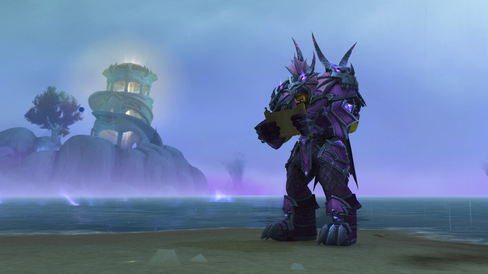

<p align="center">
  
</p>

# wxl-modern-adt

**Loads split/modern terrain tiles natively, and blends layers by height.**

A [WarcraftXL](https://github.com/WarcraftXL/wxl-core) extension. The client opens one terrain file per
tile and expects everything inside it; modern terrain is no longer built that way, a tile is three files
(root, texture, object) that only make sense together. This module reads all three and fills the client's
own terrain runtime directly, with no conversion step and no intermediate file. A tile that was already
whole is served exactly as it is.

See [`store/description.md`](store/description.md) for the full write-up (alpha maps, holes, placements,
liquid, and the height-blend feature).

## Highlights

- **Direct native read**: no version number to trust, detection keys off what the data actually contains.
- **Alpha maps, holes, placements**: re-packed, folded down, and masked to what the client's own terrain
  build expects.
- **FileDataID resolution**: doodads and objects named by id are resolved and their name tables rebuilt;
  an object that cannot be resolved is left out rather than spawned, never crashes the client.
- **Liquid normalization**: modern water layers are normalized so the stock liquid builder reads them
  natively, degrading gracefully when a type or offset cannot be trusted.
- **Height blending**: terrain layers can blend by height instead of a flat alpha ramp, so a rock texture
  doesn't fade into grass like a watercolor.
- **Crash-safe**: malformed input is a logged failure, never a crash.

## Requirements

WarcraftXL on a 3.3.5a client, build 12340. The module refuses to load against anything else rather than
guessing, and says so in the log.

## Building

This extension builds against [wxl-core](https://github.com/WarcraftXL/wxl-core) (branch `v1.1`), which
auto-discovers any folder dropped into its `extensions/` directory, so there's no project file of its own
needed here. See `.github/workflows/release.yml` for the exact steps; every push to `main` builds
`wxl-modern-adt.dll` and publishes it as a release.

## Project layout

```
src/
├── ExtensionApi.hpp/.cpp, Module.cpp   entry points, service-table plumbing
├── load/                               the native trio reader, split WDL, texture manager, chunk build
└── render/                             the per-chunk height-blend draw detour
```

## License

GPL-3.0-or-later. See the license header in every source file.
